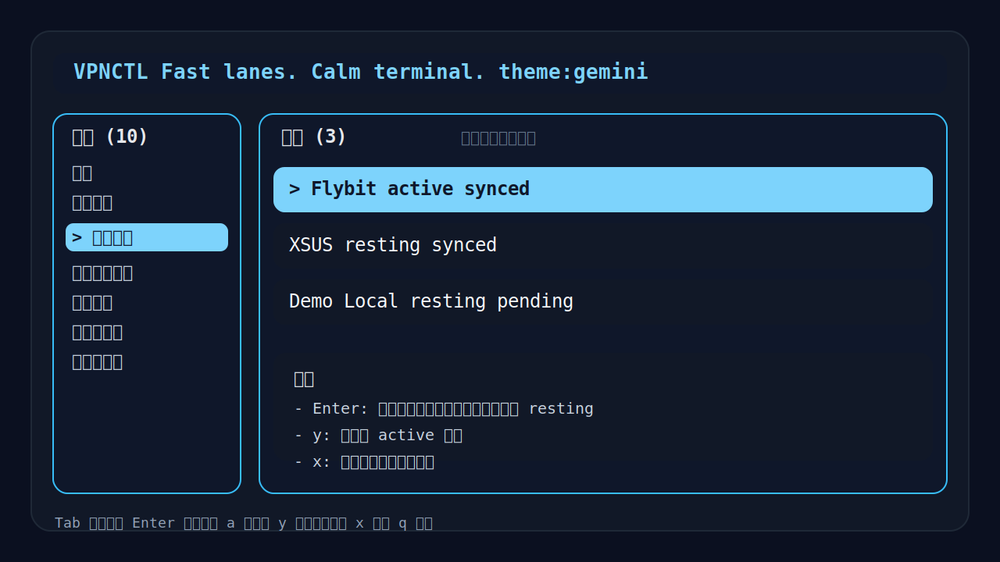
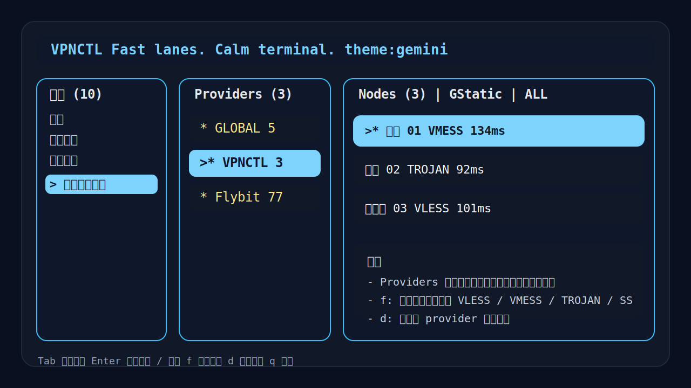

# VPNCTL

[](https://nodejs.org/)
[](https://github.com/MetaCubeX/mihomo)
[](https://opensource.org/licenses/MIT)
[](https://github.com/Eaick/Vpnctl)
[](https://github.com/Eaick/Vpnctl)

```text
 ██╗   ██╗ ██████╗  ███╗   ██╗  ██████╗ ████████╗ ██╗
 ██║   ██║ ██╔══██╗ ████╗  ██║ ██╔════╝ ╚══██╔══╝ ██║
 ██║   ██║ ██████╔╝ ██╔██╗ ██║ ██║         ██║    ██║
 ╚██╗ ██╔╝ ██╔═══╝  ██║╚██╗██║ ██║         ██║    ██║
  ╚████╔╝  ██║      ██║ ╚████║ ╚██████╗    ██║    ███████╗
   ╚═══╝   ╚═╝      ╚═╝  ╚═══╝  ╚═════╝    ╚═╝    ╚══════╝
```

Fast lanes. Calm terminal.

`VPNCTL` 是一个面向 `mihomo` 的 Node.js CLI / TUI 管理器，适合在 Windows、本地开发环境、Linux 服务器和 SSH 终端里管理代理运行时。它的目标不是再做一个重型 Clash GUI，而是提供一套更适合终端用户的工作流：初始化、导入订阅、激活订阅、同步、切换节点、测速、修改端口、Shell 集成，都尽量在一套终端 UI 内完成。

GitHub 仓库：[`Eaick/Vpnctl`](https://github.com/Eaick/Vpnctl)

## 界面预览

### 订阅管理



### Provider / 节点视图



## 特性

- 默认进入总览式 TUI，日常操作优先走 UI
- 支持远程 URL 和本地 YAML 订阅
- 支持识别多种节点协议，例如 `VLESS`、`VMess`、`Trojan`、`Shadowsocks`、`ShadowsocksR`
- 多订阅保存，但运行时只激活一个订阅，避免 `mihomo` 同时加载过多 provider
- 订阅变更后自动尝试热重载 `mihomo`，失败时自动回退重启
- 支持节点协议筛选、整组测速、主题切换、端口管理
- 支持开发沙箱模式，不污染你现有的 Clash / mihomo 环境
- 支持 Linux `bash` Shell 集成，便于同账户多会话复用代理

## 运行要求

- Node.js `>= 18`
- 平台支持：
  - Windows x64
  - Linux x64
- 默认运行时内核：`mihomo`

## 安装

```bash
npm install
npm run build
```

如果你希望把它作为全局命令使用：

```bash
npm link
```

然后可以直接运行：

```bash
vpnctl
```

## 快速开始

### 1. 启动 TUI

```bash
vpnctl
```

默认会进入总览式 UI。推荐流程是：

1. 初始化运行目录
2. 添加订阅
3. 激活你要使用的订阅
4. 同步当前激活订阅
5. 启动 `mihomo`
6. 进入节点页切换节点

### 2. 开发沙箱模式

如果你是在本机测试，建议先用开发沙箱，避免碰撞你已有的代理环境：

```bash
node ./dist/index.js dev init --skip-download
node ./dist/index.js
node ./dist/index.js dev clean
```

开发沙箱目录：

```text
.sandbox/
  mihomo/
  config/
  data/
  logs/
```

开发模式默认端口：

- HTTP: `17890`
- SOCKS: `17891`
- API: `19090`

### 3. 正式模式

```bash
vpnctl init
```

正式安装目录：

- Windows: `%USERPROFILE%/.vpnctl/`
- Linux: `~/.local/share/vpnctl/`

## 当前产品模型

这是这个项目和很多 Clash GUI 不同、但更稳定的地方：

- 你可以保存多个订阅
- 任意时刻只会有 **一个激活订阅**
- 其他订阅会进入 `resting` 状态，仅保留记录，不参与当前运行态
- `sync` 默认只同步当前激活订阅
- `Providers` 面板显示的是 **当前真正生效的运行态 provider**

这样做的目的很直接：降低多个 provider 同时加载时对 `mihomo` 的压力，减少运行态和磁盘配置不一致的问题。

## 订阅管理

### 导入订阅

远程 URL：

```bash
vpnctl add-sub --url "https://example.com/sub"
```

本地 YAML：

```bash
vpnctl add-sub --file "./subscription.yaml"
```

查看订阅：

```bash
vpnctl list-subs
```

删除订阅：

```bash
vpnctl remove-sub --id "subid"
```

### 规则说明

- 相同 URL 默认阻止重复导入
- 相同 YAML 内容默认阻止重复导入
- 同名但不同内容允许导入，并自动改名为 `A (2)`、`A (3)`
- 删除当前激活订阅时，如果还有其他订阅，会自动提升下一条为激活订阅

## 同步与激活

同步当前激活订阅：

```bash
vpnctl sync
```

按 ID 同步某个订阅：

```bash
vpnctl sync --id "subid"
```

在 TUI 中：

- 订阅页选择一条订阅后按 `Enter`：将其设为唯一激活订阅
- `a`：添加订阅
- `x`：删除订阅
- `y`：同步当前激活订阅

## 运行时管理

启动、停止、重启：

```bash
vpnctl start
vpnctl stop
vpnctl restart
```

查看状态：

```bash
vpnctl status
vpnctl doctor
```

节点与策略组：

```bash
vpnctl groups
vpnctl switch --group "VPNCTL" --node "香港 01"
vpnctl switch-country 香港
vpnctl delay
```

## 端口管理

初始化时指定端口：

```bash
vpnctl init --http-port 7890 --socks-port 7891 --api-port 9090
```

运行后修改端口：

```bash
vpnctl config set-ports --http 17890 --socks 17891 --api 19090
```

`doctor` 会显示端口来源：

- `default`
- `custom`
- `auto`
- `migrated`

如果端口冲突，会给出推荐端口。

## TUI 快捷键

- `Tab`: 切换左侧导航和右侧内容
- `Enter`: 执行动作；在订阅页用于激活当前订阅
- `/`: 搜索当前列表
- `f`: 在节点页按协议筛选
- `?`: 打开帮助
- `i`: 初始化
- `u`: 升级或迁移旧版
- `a`: 添加订阅
- `x`: 删除订阅
- `y`: 同步当前激活订阅
- `s`: 启动 `mihomo`
- `k`: 停止 `mihomo`
- `p`: 修改端口
- `b`: 安装 bashrc 片段
- `n`: 卸载 bashrc 片段
- `d`: 对当前 provider 整组测速
- `l`: 显示日志路径
- `q`: 退出

## Shell 集成

Linux `bash` 支持受管 `.bashrc` 片段：

```bash
vpnctl shell install --bashrc
vpnctl shell uninstall --bashrc
vpnctl shell print --shell bash
```

安装后可用命令：

- `vpnctl-proxy-on`
- `vpnctl-proxy-off`
- `vpnctl-proxy-status`
- `vpnctl-codex`
- `vpnon`
- `vpnoff`
- `vpnstat`
- `codexvpn`

适合服务器场景：

- A 会话启动 `mihomo`
- B 会话直接运行 `codex` 或 `codexvpn`
- 同账户多会话共享同一套 `vpnctl` 运行时

## 旧版迁移

如果你之前使用过旧版：

```bash
vpnctl upgrade
```

或：

```bash
vpnctl migrate-old
```

迁移内容包括：

- 旧版订阅 URL
- 本地 YAML 订阅路径
- 旧版端口设置
- 默认分组
- 主题设置

不会主动迁移第三方 Clash / Clash Verge / FlClash 目录。

## 验证

```bash
npm test
npm run build
node ./dist/index.js help
node ./dist/index.js doctor
```

## 项目定位

`VPNCTL` 更适合这类用户：

- 想用终端而不是完整桌面 GUI 的用户
- 需要在 SSH / Linux 服务器上管理代理的人
- 想把代理管理、订阅管理、节点切换和 Shell 复用整合到一套流程里的人

如果你在找的是“桌面托盘 + 图表 + 图形化规则编辑器”，那不是这个项目的目标。
如果你要的是“更稳定的终端工作流 + 可控的运行态模型”，那它就是为这个场景做的。

## License

MIT
