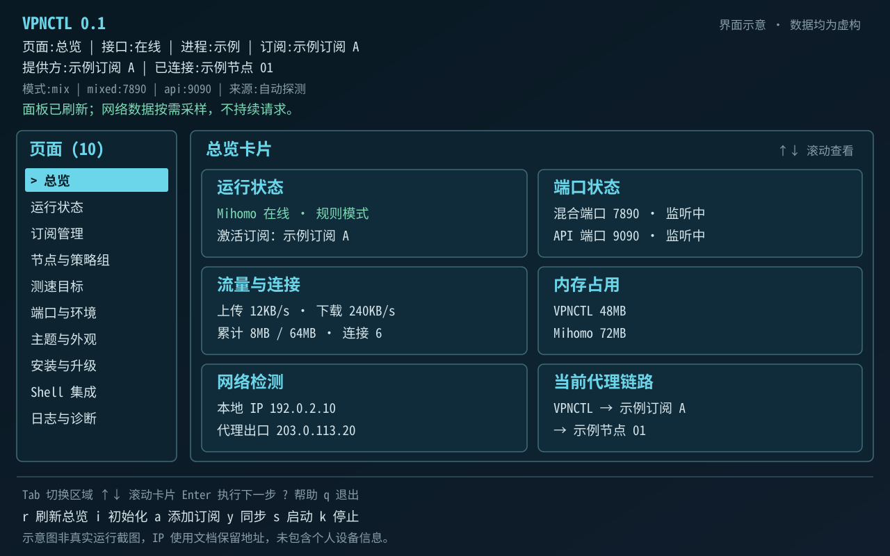
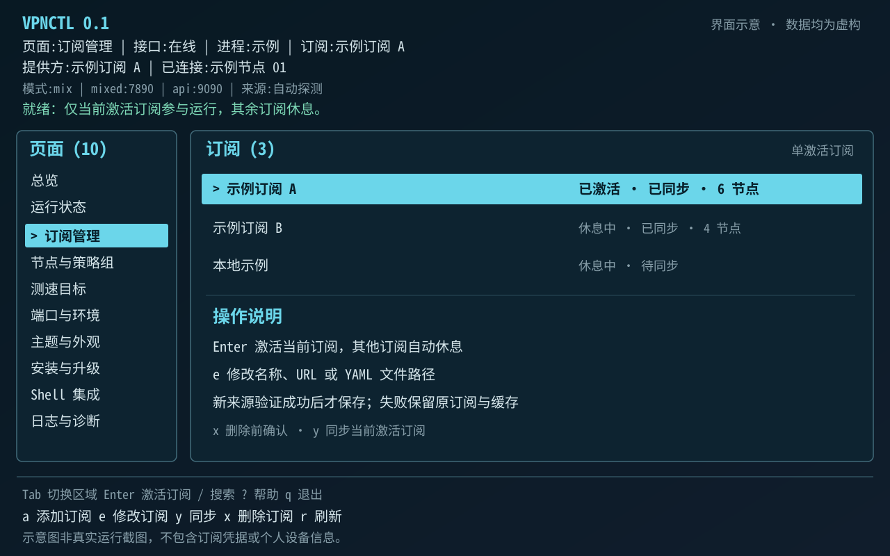
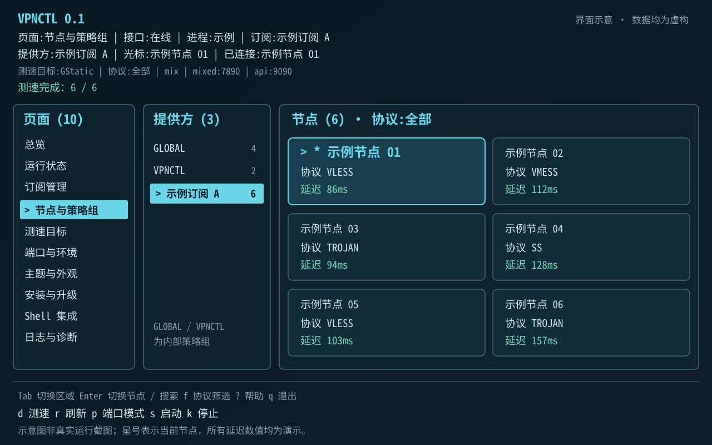

# VPNCTL

[](https://github.com/Eaick/Vpnctl)
[](https://nodejs.org/)
[](https://github.com/MetaCubeX/mihomo)
[](https://opensource.org/licenses/MIT)
[](https://github.com/Eaick/Vpnctl)

```text
██╗   ██╗██████╗ ███╗   ██╗ ██████╗████████╗██╗
██║   ██║██╔══██╗████╗  ██║██╔════╝╚══██╔══╝██║
██║   ██║██████╔╝██╔██╗ ██║██║        ██║   ██║
╚██╗ ██╔╝██╔═══╝ ██║╚██╗██║██║        ██║   ██║
 ╚████╔╝ ██║     ██║ ╚████║╚██████╗   ██║   ███████╗
  ╚═══╝  ╚═╝     ╚═╝  ╚═══╝ ╚═════╝   ╚═╝   ╚══════╝
```

**VPNCTL 是面向 Linux 服务器和 SSH 会话的 Mihomo 终端管理器。** 不依赖桌面环境，在中文 TUI 中管理订阅、选择节点、测速、配置端口，并让当前账户的终端应用使用代理。

VPNCTL 当前版本：**0.1**，项目版本字段为 `0.1.0`。它不是全系统透明代理，不自动接管其他用户或其他进程的网络。

## 界面预览

以下 SVG 为界面示意图，数据均为虚构，不是个人运行截图。

### 总览卡片



### 订阅管理



### 节点卡片



## 功能

- 中文 TUI，支持初始化进度可视化、订阅删除确认和运行状态摘要
- 导入远程订阅 URL、本地 YAML 或分享链接列表，可修改来源及名称
- 支持识别多种协议标签，例如 `VLESS`、`VMESS`、`TROJAN`、`SS`、`SSR`
- 保存多个订阅，但任意时刻只激活一个，其余订阅休息
- 支持节点协议筛选、节点测速、主题切换、Shell 集成和端口管理
- 默认 `mix` 模式：HTTP 与 SOCKS5 共用混合端口，另设 API 端口
- 可切换 `separate` 模式：HTTP、SOCKS5 与 API 分别使用端口
- 对运行时做了账户隔离校验，避免不同系统用户误复用同一个 API 端口

## 运行要求

- Node.js `>= 18`
- Linux x64、Bash 和可正常显示中文的终端
- npm；使用 Git 拉取源码时需安装 Git
- Mihomo：由初始化流程下载，安装脚本本身不下载内核
- `curl`：用于总览网络检测；`pgrep`、`readlink`：用于卸载安全检查

安装和运行请使用自己的普通账户，不要通过 `sudo` 启动 VPNCTL。初始化下载内核、远程订阅同步和安装依赖需要服务器能访问对应下载源。

## 安装

先获取源码，再运行管理菜单：

```bash
git clone https://github.com/Eaick/Vpnctl.git
cd Vpnctl
bash scripts/vpnctl.sh
```

```text
1. 安装
2. 卸载
3. 测试
0. 退出
```

选择 `1`，脚本依次执行 `npm install`、`npm run build`、`npm link`，完成后输入 `vpnctl` 即可使用。也可直接运行 `bash scripts/vpnctl.sh install`，或手动安装：

```bash
npm install
npm run build
npm link
vpnctl
```

## 开始使用

### 1. 初始化

```bash
vpnctl init
```

默认会使用 `mix` 模式。初始化过程会显示分步进度，包括目录准备、端口探测、二进制准备、订阅存储初始化和受管配置生成。

### 2. 启动 TUI

```bash
vpnctl
```

推荐在 TUI 中按以下顺序操作：

1. 添加订阅
2. 激活需要使用的订阅
3. 同步当前订阅
4. 启动 `mihomo`
5. 在节点页切换节点并测速

节点页以卡片显示节点名、协议和测速结果；总览卡片显示当前链路、端口、内网/代理出口 IP、连接数及 VPNCTL/Mihomo 内存。进入总览或按 `r` 刷新时才进行一次网络采样，不持续轮询。出口 IP 查询会通过当前 VPNCTL 代理请求 [ipify](https://www.ipify.org/)；需要 `curl`，缺失或请求失败时只影响网络卡片。

## 订阅管理

- 可以保存多个订阅
- 任意时刻只会有一个激活订阅
- 其他订阅处于休息状态，不参与当前运行
- `sync` 默认只同步当前激活订阅
- 同步结果为空或失败时保留上次成功的 Provider 缓存；TUI 不会激活同步失败的订阅
- 提供方面板包含当前运行的策略组和订阅；`GLOBAL`、`VPNCTL` 是内部策略组，不是机场名称
- 在 TUI 订阅页选中订阅按 `e`，可修改名称、URL 或本地 YAML 路径；新来源验证成功后才替换缓存

```bash
vpnctl add-sub --url "https://example.com/sub" --name "示例订阅"
vpnctl add-sub --file "/srv/vpn/nodes.yaml" --name "本地订阅"
vpnctl list-subs
vpnctl edit-sub --id "subscription-id" --url "https://example.com/new-sub" --name "新名称"
vpnctl edit-sub --id "subscription-id" --file "/srv/vpn/nodes.yaml"
vpnctl sync
vpnctl remove-sub --id "subscription-id"
```

修改订阅时保留原 ID、Provider 标识及激活状态，也可在 URL 与本地文件之间切换。仅修改名称不会重新拉取订阅；来源变更会先读取并检查节点，读取失败或无可识别节点时保留原订阅及缓存。编辑弹窗中可按 `Ctrl+U` 清空当前字段，`Enter` 保存，`Esc` 取消。

## 端口与联网

默认使用混合端口模式。端口可能因占用而自动调整，请以 `vpnctl status` 或 TUI 中显示的实际端口为准，不要假定固定为 7890 或 9090。

```bash
vpnctl status
vpnctl doctor
vpnctl config set-ports --proxy-mode mix
vpnctl config set-ports --proxy-mode separate
```

运行中切换端口模式会停止并重启本账户受管的 Mihomo；若新端口未就绪，会尝试恢复原配置和端口。未运行时只保存设置，下次启动生效。

测试实际代理连接时，把下例的端口替换为当前有效的混合端口或 HTTP 端口：

```bash
curl --noproxy '' -x http://127.0.0.1:7890 --max-time 15 -I https://www.google.com/
```

## 终端与 Codex 代理

安装 VPNCTL 的受管 Bash 配置块：

```bash
vpnctl shell install
source ~/.bashrc
```

启用后，`codex` 与 `codexvpn` 会在启动时检查本账户受管的 Mihomo，并使用当前有效代理端口；内核未运行时清除相关代理变量。`vpnon`、`vpnoff` 可启用或关闭当前终端的代理变量，`vpnstat` 查看诊断。

这些功能只影响使用该配置的 Bash 会话，不是 TUN 或操作系统全局代理。不同系统账户拥有各自的运行目录、订阅和内核状态。

## 测试

在管理菜单选择 `3`，或执行：

```bash
bash scripts/vpnctl.sh test
bash scripts/vpnctl.sh test subscriptions
bash scripts/vpnctl.sh test all
bash scripts/vpnctl.sh test entry
bash scripts/vpnctl.sh tui
```

测试菜单按订阅管理、初始化与端口、运行安全、TUI 卡片与布局、Shell 集成和构建入口分类，输出测试明细及通过/失败结果。`test/` 是源码中的自动测试，由脚本统一调用。运行前需安装依赖，并按提示确认可能清理的测试数据；失败不会退出交互菜单。

自动测试不代表真实机场节点一定能联网，也不启动实际 Mihomo；`tui` 用于查看界面。无交互输入时，`test` 默认运行全部自动测试并通过退出码报告结果。

## 卸载

从源码目录选择管理菜单的 `2`，或执行：

```bash
bash scripts/vpnctl.sh uninstall
```

卸载脚本按以下顺序处理：

1. 确认并停止本账户受管的 Mihomo；无法确认停止时中止卸载，不继续删除文件。
2. 从安装时记录的 Bash 配置文件（默认 `~/.bashrc`）删除 VPNCTL 受管块，并检查是否仍有残留标记。
3. 解除指向本源码目录的全局 npm link，删除受管内核及生成的配置。
4. 询问是否保留订阅、Provider 缓存及个人配置；删除个人数据需要再次确认。

删除的 Bash 受管块位于以下标记之间，包含 VPNCTL 代理函数、Codex 包装函数及相关别名：

```text
# >>> vpnctl >>>
...
# <<< vpnctl <<<
```

**删除 `.bashrc` 中的配置，不会自动清除已打开终端中加载的函数或代理变量。** Mihomo 停止后，旧代理变量仍可能指向已关闭的端口，导致 npm、curl 或 Codex 连接失败。

卸载后请打开新的 SSH 会话。若要继续使用当前 Bash 会话，可执行：

```bash
unset HTTP_PROXY HTTPS_PROXY ALL_PROXY http_proxy https_proxy all_proxy
unset -f vpnctl-proxy-on vpnctl-proxy-off vpnctl-proxy-status vpnctl-codex-env vpnctl-codex codex
unalias vpnon vpnoff vpnstat codexvpn 2>/dev/null || true
```

以上命令清除当前会话的代理变量和受管包装，不会卸载 Codex 本身。仅重新执行 `source ~/.bashrc` 不会删除已加载的旧函数。如果曾手动粘贴不带受管标记的旧配置，需另行检查并清理该片段。

脚本不会删除 `~/.codex`、其他软件的代理配置或源码目录。若卸载中止，尚未执行的清理步骤不会继续。

## 运行数据

个人运行目录默认为 `~/.local/share/vpnctl/`，包含内核、安装状态、订阅、缓存、生成配置和日志。卸载时默认保留个人订阅数据。

仓库仅提供 [公开配置示例](./config.example.yaml)。真实订阅链接、节点凭据、个人运行配置及日志不应提交到 GitHub。


## 许可证

MIT
